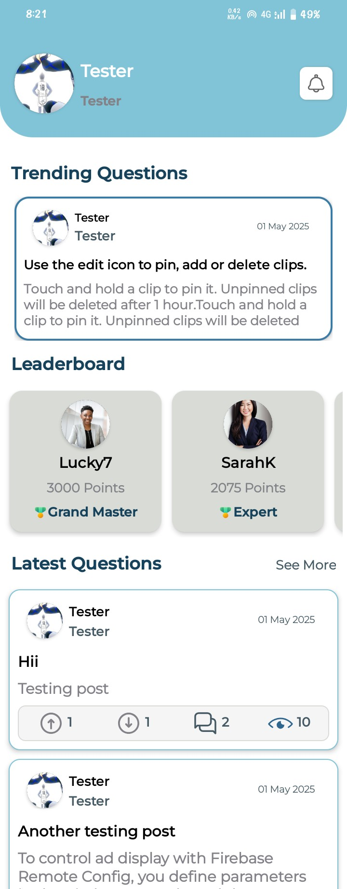

# AskNShare 📚💬  
**Your Knowledge Hub: Ask, Answer, Grow**

---

## 🧾 Overview

**AskNShare** is a community-driven Q&A mobile application designed for students, educators, and professionals. It enables structured question-and-answer exchanges, boosts engagement through gamification, and supports both human learning and AI assistance.

---

## 🚀 Tech Stack

---

## 📱 Key Features

- ✍️ **Ask & Answer Questions:** Structured, subject-specific discussions
- 🧑‍🎓 **User Profiles:** Showcase skills, track credibility
- 🏆 **Leaderboards & Badges:** Gamified motivation system
- 🤖 **AI Support (Gemini):** Instant suggestions and responses
- 🔐 **Anonymous Posting:** Encourages shy users to contribute
- 📌 **Bookmarking:** Save answers for future reference
- 👍 **Upvote/Downvote:** Highlight quality contributions

---

## 🧭 App Flow

1. **Login/Signup**
2. **Profile Setup**
3. **Browse Questions / Ask a New One**
4. **Provide Answers / Receive Upvotes**
5. **Earn Badges & Climb the Leaderboard**

---

## 📸 Screenshots

| Screen | Preview |
|--------|---------|
| Welcome Screen |  |
| Login Screen |  |
| Home |  |
| Post Question |  |
| Full View |  |
| Profile |  |

> _Make sure to upload these images in the `/screenshots` folder of your repo._

---

## 🤝 Contributing

Want to contribute?

1. Fork this repository  
2. Create a new branch (`git checkout -b feature-name`)  
3. Make your changes  
4. Commit (`git commit -m 'Add new feature'`)  
5. Push (`git push origin feature-name`)  
6. Create a Pull Request  

---

## 📬 Contact

**Hamama Komal**  
🔗 [GitHub Profile](https://github.com/Hamama-Komal)  
🌐 [LinkedIn](https://www.linkedin.com/in/hamama-komal/)

---

## 📄 License

This project is licensed under the [MIT License](LICENSE).

> _Ask. Share. Grow._ 🌱
